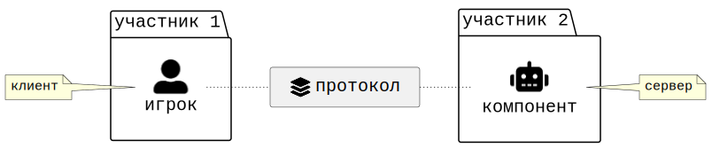

# Архитектура

Целью данной модели является не классификация игр, а описание архитектуры взаимодействия участника и системы. Модель выделяет аспекты игры, протоколы доступа к ним и компоненты, реализующие эти протоколы.

Архитектурные уровни:

1. Аспекты отвечают на вопрос:
   что существует в игре?
1. Протоколы отвечают на вопрос:
   как участник взаимодействует с аспектами?
1. Компоненты отвечают на вопрос:
   кто реализует соответствующий протокол?

## Система координат

Любой элемент игры можно наложить на простейшую систему координат.

Первая ось различает _возможность_ и _данность_. Возможность описывает то, что может быть реализовано в процессе игры. Данность описывает то, что уже присутствует в игре.

Вторая ось различает _абстрактное_ и _конкретное_. Абстрактное описывает смысловые и концептуальные структуры игры. Конкретное описывает их непосредственную реализацию.

    

Пересечение этих осей образует четыре _аспекта_ игры. Аспекты описывают разные способы представления предметной области, которую моделирует игра. Предметная область выбирается максимально широко и описывает класс явлений/сущностей, моделируемых игрой.

_Тема_ [^1] определяет абстрактные явления предметной области, которые считаются значимыми (по мнению автора).

_Арки_ [^2] определяют потенциальные траектории изменения явлений предметной области.

_Сеттинг_ [^1] определяет конкретные сущности предметной области, которые считаются характерными (по мнению автора).

_Механики_ [^2] определяют потенциальные взаимодействия сущностей предметной области.

    

 

## Компоненты и протоколы

Участники не взаимодействуют друг с другом напрямую — только через _систему_, которая служит общим посредником. Система состоит из _компонентов_ — внутренней реализации игровых _протоколов_. Сами протоколы — это интерфейсы на границе системы: через них участник получает доступ к аспектам игры. Компоненты могут исполняться любыми участниками игры. Например, в соло игре без приложения всё (в т.ч. компоненты) исполняется единственным участником, а в НРИ игромастер является выделенным участником для исполнения компонентов.

Каждый протокол определяет тип сообщений, которыми обмениваются игроки и компоненты. Протокол определяет допустимые сообщения, а компонент определяет способ их обработки. В любой конкретный момент выбор сообщения ограничен множеством доступных вариантов. Игрок или компонент выбирает одно из них и отправляет через соответствующий протокол. После получения сообщение обрабатывается, и состав доступных сообщений может измениться. Компонент не обязан полностью реализовывать соответствующий протокол. Часть функций может отдаваться на откуп участникам.

    

Персонаж — это протокол коммуникации по поводу _намерений_ игрока, обусловленный аркой и темой. Через персонажа игрок получает доступ к смыслам игры и к пространству своего возможного изменения. Персонаж отвечает на вопрос: кто я в этой истории и кем могу стать.  
Аватар — это протокол коммуникации по поводу _действий_ игрока, обусловленный механикой и сеттингом. Через аватара игрок получает доступ к тому, что он может сделать, и к миру, в котором это происходит. Аватар отвечает на вопрос: что я могу сделать прямо сейчас и где я нахожусь.  
Прогноз — это протокол коммуникации по поводу _допущений_ игрока, обусловленный аркой и механикой. Через прогноз игрок получает представление о потенциальном развитии той или иной ситуации. Прогноз отвечает на вопрос: к чему приведут те или иные воздействия и приближают ли они к цели.  
Нарратив — это протокол коммуникации по поводу _суждений_ игрока, обусловленный темой и сеттингом. Через нарратив игрок получает представление о значении конкретных событий мира. Нарратив отвечает на вопрос: что означает то, что произошло, и как это связано с тем, про что эта игра.

    

Ментор — это компонент, реализующий протокол персонажа. Он отвечает за формирование замысла: определяет цели, приоритеты и критерии успеха. Ментор отвечает на вопрос: что важно и к чему стремиться.  
Движок — это компонент, реализующий протокол аватара. Он отвечает за представление текущего состояния системы: фиксирует, что существует, что доступно и что изменилось в результате действия. Движок отвечает на вопрос: каково положение дел прямо сейчас.  
Оракул — это компонент, реализующий протокол прогноза. Он отвечает за построение допущений о будущем состоянии системы: рассчитывает вероятности, моделирует последствия, оценивает развитие ситуации. Оракул отвечает на вопрос: к чему это может привести.  
Нарратор — это компонент, реализующий протокол нарратива. Он отвечает за интерпретацию произошедшего в терминах темы и сеттинга: придаёт событиям смысл, связывает их в историю. Нарратор отвечает на вопрос: что это означает и про что эта игра.

    

## Участники

В основе лежит различие между проактивным и реактивным поведением. Проактивность — свободное поведение участника в свой ход. Реактивность — триггерное поведение участника в ход другого.

Это различие определяет две позиции, которые может занять участник: _игрок_ и _среда_. Игрок всегда проактивен, а среда — реактивна. Один и тот же участник может занимать обе позиции. Разные участники могут занимать одну и ту же позицию. Если провести аналогию, то участник, занимающий позицию, выступает "клиентом" протокола коммуникации, а участник, исполняющий компонент, выступает "сервером" протокола коммуникации.

    

Противостояние двух игроков будем называть _соперничеством_. Противостояние игрока и _среды_ будем называть _сопротивлением_. Например, в шахматах есть соперничество, но нет сопротивления (даже при игре с компьютером). В пасьянсах/кооперативах есть сопротивление, но нет соперничества. В играх-гонках, как правило, есть и то, и другое.

Как сопротивляется среда? За счет реактивных элементов, которые встраиваются в компоненты, в результате чего компоненты начинают "реагировать" на поведение игрока. Например, колода болезней в Пандемии реагирует на завершение хода игрока новыми картами болезней.

## Примеры

#### Взрывные котята (Exploding Kittens)

| Аспект | |
| ------ | ------------- |
| `Тема` | Русская рулетка (юмористическая вариация). |
| `Сеттинг` | Сюрреалистический мир котов. |
| `Механики` | Менеджмент руки, hot potato, блеф, выбывание игрока. |
| `Арки` | От безобидного до безжалостного поведения ради победы. |

| Протокол | |
| -------- | ------------- |
| `Персонаж` | Базовое намерение выжить любой ценой, в т.ч. за счет подставы соперников. |
| `Аватар` | Действия с руки, которые можно сыграть в свой ход. |
| `Прогноз` | Допущения по поводу вероятности вытянуть взрывного котёнка, исходя из числа карт, оставшихся в колоде, и числа выбывших игроков. |
| `Нарратив` | История о том, кто взорвался, кто избежал взрыва, кто успешно блефовал или раскрыл блеф. |

| Компонент | |
| --------- | ------------- |
| `Ментор` | Вырабатывает стратегию собственного выживания и подставы других игроков. Исполняется участниками без привязки к ходу. |
| `Движок` | Представляет текущее состояние: колода и сброс. Исполняется участником в свой ход. |
| `Оракул` | Рассчитывает вероятность вытянуть взрывного котёнка. Отчасти представлен физически картой "Подсмуртри грядущее". Исполняется участником без привязки к ходу. |
| `Нарратор` | Встроен в иллюстрации и юмористический текст. Усиливается комментариями самих участников по ходу партии. Исполняется участниками без привязки к ходу. |

Итого:
- Розыгрыш карты из колоды является примером реактивного ответа среды на завершение хода.
- Розыгрыш карты "Неть" является примером реактивного ответа среды на действие игрока.

#### Шахматы (Chess)

| Аспект | |
| ------ | ------------- |
| `Тема` | Военное противостояние. |
| `Сеттинг` | Средневековье. Выражено визуальным языком фигур. |
| `Механики` | Правила хода и взятия фигур. |
| `Арки` | От равного по силам до победившего либо разгромленного полководца. |

| Протокол | |
| -------- | ------------- |
| `Персонаж` | Список военных операций (замыслы в предметной области войны). |
| `Аватар` | Список фигур, которые могут ходить прямо сейчас. |
| `Прогноз` | Дерево допущений по поводу продолжений противника. |
| `Нарратив` | История суждений по поводу хода сражения. |

| Компонент | |
| --------- | ------------- |
| `Ментор` | Вырабатывает стратегию. Исполняется участником без привязки к ходу. В серьёзной игре — исполняется тренером. |
| `Движок` | Представляет текущее состояние доски. Исполняется участником в свой ход. |
| `Оракул` | Конструирует потенциальное состояние доски. Исполняется участником без привязки к ходу. В серьёзной игре — исполняется секундантом на этапе подготовки к партии. |
| `Нарратор` | Объясняет происходящее. Исполняется участником в свой ход. В серьёзной игре — исполняется комментатором. |

Итого:
- Один и тот же участник занимает позицию игрока и исполняет системные компоненты.
- Движок является единственным компонентом, который представлен физически. Остальные компоненты представлены ментально в виде способностей, которые нарабатываются с опытом.

#### Корни (Root)

| Аспект | |
| ------ | ------------- |
| `Тема` | Борьба за власть. Сила и право. Правление и сопротивление. |
| `Сеттинг` | Средневековье в традиции притч с антропоморфными животными. |
| `Механики` | Базовые механики перемещения, строительства, ремесла и сражения. Плюс специфичные механики каждой фракции. |
| `Арки` | От локального присутствия до контроля над лесом (для разных фракций — разные траектории). |

| Протокол | |
| -------- | ------------- |
| `Персонаж` | Базовое намерение получения [признания](https://boardgamegeek.com/thread/2042891/article/29771337) среди [жителей](https://www.youtube.com/watch?v=dLNFWygk2Cs) леса (общая колода карт). Плюс специфичные намерения каждой фракции. |
| `Аватар` | Базовые действия, действия с планшета, действия с руки и действия с табло, которые становятся доступны после крафта карт с длительными свойствами. |
| `Прогноз` | Допущения по поводу потенциальных ходов других фракций. |
| `Нарратив` | Суждения по поводу выполненного хода фракции. |

| Компонент | |
| --------- | ------------- |
| `Ментор` | Построение и адаптация стратегии набора победных очков. Исполняется участником без привязки к ходу. |
| `Движок` | Представление текущего состояния. Включает физические компоненты: поле/планшеты/табло, воины/фишки, здания/жетоны/предметы и кубы. Исполняется участником в свой ход. |
| `Оракул` | Частично представлен сбросом общем колоды, треком победных очков, треками на планшетах фракций. Остальное исполняется участником без привязки к ходу. |
| `Нарратор` | Встроен на уровне языка, который используется в правилах. Исполняется участником в свой ход. |

Итого:
- Один и тот же участник занимает позицию игрока и исполняет системные компоненты.
- Розыгрыш карты засады является единственным примером реактивного ответа среды.
- Асимметричные механики выполняют нарративную функцию.

#### Пандемия (Pandemic)

| Аспект | |
| ------ | ------------- |
| `Тема` | Борьба за выживание. |
| `Сеттинг` | Современный мир, карта реальных городов. |
| `Механики` | Коллекция механик объединенных в одноименную систему «Пандемия». |
| `Арки` | От рядового эксперта до спасителя человечества. |

| Протокол | |
| -------- | ------------- |
| `Персонаж` | Явная роль, которая определяет список намерений. |
| `Аватар` | Базовые, ролевые и ситуативные действия. |
| `Прогноз` | Список допущений по поводу выхода карт болезней. |
| `Нарратив` | История суждений по поводу игровых событий. |

| Компонент | |
| --------- | ------------- |
| `Ментор` | Вырабатывает стратегию борьбы с эпидемией. Исполняется всеми участниками. |
| `Движок` | Представляет текущее состояние поля. Исполняется участником в свой ход. |
| `Оракул` | Рассчитывает вероятности выхода карт. Исполняется всеми участниками. |
| `Нарратор` | Фиксирует происходящее в терминах темы и сеттинга. Исполняется участником в свой ход. |

Итого:
- Оракул отчасти представлен физически в виде сброса колоды болезней.
- Нарратор в виде текста практически не представлен. Но трек вспышек выполняет нарративную функцию.

[^1]: Подразумевается тема и сеттинг в литературном смысле, т.к. в сообществе настольщиков часто сеттинг называют темой. Но существуют и обратные примеры (например, [раз](https://louardongames.blogspot.com/2014/08/theme-setting.html), [два](https://bumblingthroughdungeons.com/theme-setting-and-mechanics-in-games) и [три](https://www.youtube.com/watch?v=tAHnu4PIyG0)).  
[^2]: Термины механик и арок взяты из [статьи](https://lostgarden.com/2012/04/30/loops-and-arcs) и [доклада](https://www.youtube.com/watch?v=qwPe3OHR04c) Даниэля Кука. Или на русском из [доклада](https://www.youtube.com/watch?v=RDZdxjzFKzI&t=968s) Андрея Столярова. В оригинале Кук использует термин _loops_, но в качестве примеров приводит различные механики. Столяров подтверждает, что "петли это просто понятие, которое используется для описания игровых механик".  
