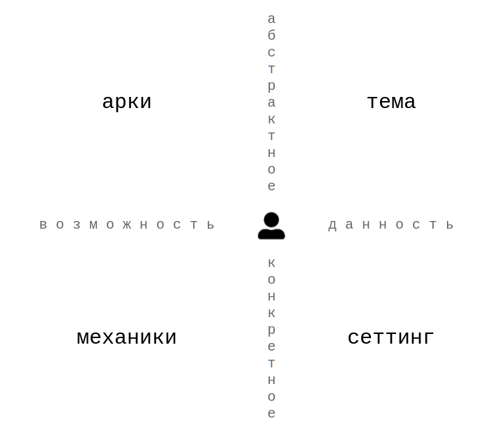
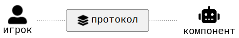
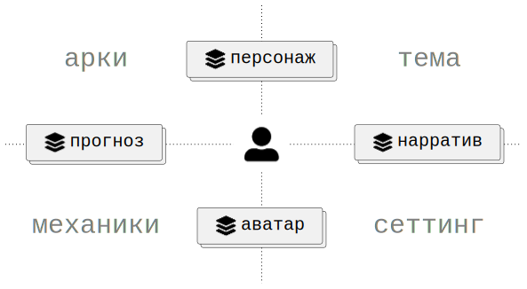
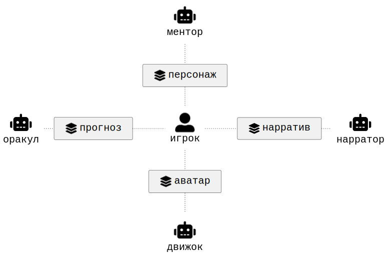

# Архитектурная модель

Целью данной модели является не классификация игр, а описание архитектуры взаимодействия игрока и системы. Модель выделяет аспекты игры, протоколы доступа к ним и компоненты, реализующие эти протоколы.

Архитектурные уровни:

1. Аспекты отвечают на вопрос:
   что существует в игре?
1. Протоколы отвечают на вопрос:
   как игрок взаимодействует с аспектами?
1. Компоненты отвечают на вопрос:
   кто реализует соответствующий протокол?

## Система координат

Любой элемент игры можно наложить на простейшую систему координат.

Первая ось различает _возможность_ и _данность_. Возможность описывает то, что может быть реализовано в процессе игры. Данность описывает то, что уже присутствует в игре.

Вторая ось различает _абстрактное_ и _конкретное_. Абстрактное описывает смысловые и концептуальные структуры игры. Конкретное описывает их непосредственную реализацию.

    

Пересечение этих осей образует четыре _аспекта_ игры.

_Арки_ [^1] описывают направления возможных изменений и преобразований. Они относятся к возможности на уровне абстрактных идей.

_Механики_ [^1] описывают способы реализации этих изменений. Они относятся к возможности на уровне конкрентного воплощения.

_Тема_ [^2] описывает смысловое содержание, заложенное автором. Она относится к данности на уровне абстрактных идей.

_Сеттинг_ [^2] описывает контекст игры: мир, объекты, обстоятельства и сущности. Он относится к данности на уровне конкрентного воплощения.

    

 

## Компоненты и протоколы

Участники не взаимодействуют друг с другом напрямую — только через _систему_, которая служит общим посредником. Система состоит из _компонентов_ — внутренней реализации игровых _протоколов_. Сами протоколы — это интерфейсы на границе системы: через них участник получает доступ к аспектам игры. Компоненты могут исполняться любыми участниками игры. Например, в соло игре без приложения компоненты системы исполняются игроком, а в НРИ — игромастером.

    

Персонаж — это протокол _намерений_ игрока, обусловленный аркой и темой. Через персонажа игрок получает доступ к смыслам игры и к пространству своего возможного изменения. Персонаж отвечает на вопрос: кто я в этой истории и кем могу стать.  
Аватар — это протокол _действий_ игрока, обусловленный механикой и сеттингом. Через аватара игрок получает доступ к тому, что он может сделать, и к миру, в котором это происходит. Аватар отвечает на вопрос: что я могу сделать прямо сейчас и где я нахожусь.  
Прогноз — это протокол _допущений_ игрока, обусловленный аркой и механикой. Через прогноз игрок получает представление о потенциальном развитии той или иной ситуации. Прогноз отвечает на вопрос: к чему приведут те или иные воздействия и приближают ли они к цели.  
Нарратив — это протокол _суждений_ игрока, обусловленный темой и сеттингом. Через нарратив игрок получает представление о значении конкретных событий мира. Нарратив отвечает на вопрос: что означает то, что произошло, и как это связано с тем, про что эта игра.

    

Ментор — это компонент, реализующий протокол персонажа. Он отвечает за формирование замысла: определяет цели, приоритеты и критерии успеха. Ментор отвечает на вопрос: что важно и к чему стремиться.  
Движок — это компонент, реализующий протокол аватара. Он отвечает за представление текущего состояния системы: фиксирует, что существует, что доступно и что изменилось в результате действия. Движок отвечает на вопрос: каково положение дел прямо сейчас.  
Оракул — это компонент, реализующий протокол прогноза. Он отвечает за построение допущений о будущем состоянии системы: рассчитывает вероятности, моделирует последствия, оценивает развитие ситуации. Оракул отвечает на вопрос: к чему это может привести.  
Нарратор — это компонент, реализующий протокол нарратива. Он отвечает за интерпретацию произошедшего в терминах темы и сеттинга: придаёт событиям смысл, связывает их в историю. Нарратор отвечает на вопрос: что это означает и про что эта игра.

    

## Роли и противостояние

В основе лежит различие между проактивным и реактивным поведением. Проактивность — произвольное поведение участника в свой ход. Реактивность — заданный ответ в ход другого участника.

Это различие определяет две роли: _игрок_ и _среда_. Игрок всегда проактивен, а среда — реактивна. Один и тот же участник может исполнять обе роли. Одна и та же роль может исполняться разными участниками.

Противостояние двух игроков (PvP) будем называть _соперничеством_. Противостояние игрока и _среды_ (PvE) будем называть _сопротивлением_. Например, в шахматах есть соперничество, но нет сопротивления (даже в игре с компьютером). В пасьянсах/кооперативах есть сопротивление, но нет соперничества. В играх-гонках, как правило, есть и то, и другое.

Как сопротивляется среда? За счет реактивных элементов, которые встраиваются в компоненты, в результате чего компоненты начинают "реагировать" на поведение игрока. Например, колода болезней в Пандемии реагирует на завершение хода игрока новыми картами болезней.

## Примеры

#### Шахматы

| Аспект | |
| ------ | ------------- |
| `Тема` | Война/сражение с трёхактной структурой (дебют/миттельшпиль/эндшпиль). |
| `Сеттинг` | Средневековье. Выражено визуальным языком фигур. |
| `Механики` | Правила хода каждой фигуры. |
| `Арки` | Развитие фигур. |

| Протокол | |
| -------- | ------------- |
| `Персонаж` | Список "военных" операций, которые могут быть предприняты прямо сейчас. |
| `Аватар` | Список фигур, которые могут ходить прямо сейчас. |
| `Прогноз` | Дерево допущений по поводу продолжений противника. |
| `Нарратив` | История суждений по поводу хода сражения. |

| Компонент | |
| --------- | ------------- |
| `Ментор` | Вырабатывает стратегию. Исполняется игроком. В серьёзной игре — исполняется тренером. |
| `Движок` | Представляет текущее состояние доски. Исполняется игроком. |
| `Оракул` | Конструирует потенциальное состояние доски. Исполняется игроком. В серьёзной игре — исполняется секундантом. |
| `Нарратор` | Объясняет происходящее. Исполняется игроком. В серьёзной игре — исполняется комментатором. |

Итого:
- Два абсолютно симметричных участника.
- Все компоненты системы исполняются игроками.
- Движок является единственным компонентом, который представлен физически. Остальные компоненты представленны ментально в виде способностей, которые нарабатываются с опытом.

#### Пандемия

| Аспект | |
| ------ | ------------- |
| `Тема` | Борьба за выживание. Прослеживается трехактная структура. |
| `Сеттинг` | Современный мир, карта реальных городов. |
| `Механика` | Оригинальная одноименная механика — система «Пандемия». |
| `Арка` | От рядового эксперта до спасителя человечества. |

| Протокол | |
| -------- | ------------- |
| `Персонаж` | Явная роль, которая определяет список намерений. |
| `Аватар` | Базовые, ролевые и ситуативные действия. |
| `Прогноз` | Список допущений по поводу выхода карт болезней. |
| `Нарратив` | История суждений по поводу игровых событий. |

| Компонент | |
| --------- | ------------- |
| `Ментор` | Вырабатывает стратегию борьбы с эпидемией. Исполняется игроками. |
| `Движок` | Представляет текущее состояние поля. Исполняется игроками. |
| `Оракул` | Рассчитывает вероятности выхода карт. Исполняется игроками. |
| `Нарратор` | Фиксирует происходящее в терминах темы и сеттинга. Исполняется игроками. |

Итого:
- Все компоненты системы исполняются игроками.
- Оракул отчасти представлен физически в виде сброса колоды болезней.
- Нарратор в виде текста практически не представлен. Но трек вспышек выполняет нарративную функцию.

[^1]: Термины арки и механики взяты из [статьи](https://lostgarden.com/2012/04/30/loops-and-arcs) и [доклада](https://www.youtube.com/watch?v=qwPe3OHR04c) Даниэля Кука. Или на русском из [доклада](https://www.youtube.com/watch?v=RDZdxjzFKzI&t=968s) Андрея Столярова. В оригинале Кук использует термин _loop_, но в качестве примеров приводит различные механики. Столяров подтверждает, что "петли это просто понятие, которое используется для описания игровых механик".  
[^2]: Подразумевается тема и сеттинг в литературном смысле, т.к. в сообществе настольщиков часто сеттинг называют темой. Но существуют и обратные примеры (например, [раз](https://louardongames.blogspot.com/2014/08/theme-setting.html), [два](https://bumblingthroughdungeons.com/theme-setting-and-mechanics-in-games) и [три](https://www.youtube.com/watch?v=tAHnu4PIyG0)).  
