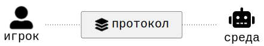
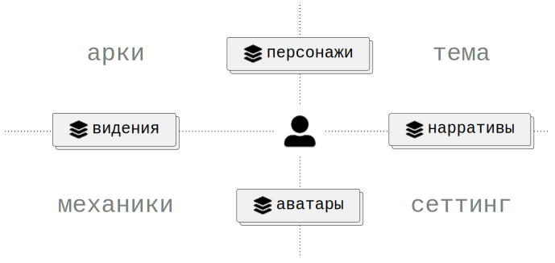

# Архитектурная модель

Целью данной модели является не классификация игр, а описание архитектуры взаимодействия игрока и среды. Модель выделяет аспекты игры, протоколы доступа к ним и компоненты, реализующие эти протоколы.

Архитектурные уровни:

1. Аспекты отвечают на вопрос:
   что существует в игре?
2. Протоколы отвечают на вопрос:
   как игрок взаимодействует с аспектами?
3. Компоненты отвечают на вопрос:
   кто реализует соответствующий протокол?

## Координаты и аспекты

Любой элемент игры можно расположить на простейшей системе координат.

Первая ось различает _возможность_ и _данность_. Возможность описывает то, что может быть реализовано в процессе игры. Данность описывает то, что уже присутствует в игре.

Вторая ось различает _абстрактное_ и _конкретное_. Абстрактное описывает смысловые и концептуальные структуры игры. Конкретное описывает их непосредственную реализацию.

    

Пересечение этих осей образует четыре _аспекта_ игры.

_Арки_ [^1] описывают направления возможных изменений и преобразований. Они относятся к возможности на уровне абстрактной идеи.

_Механики_ [^1] описывают способы реализации этих изменений. Они относятся к возможности на уровне конкрентного воплощения.

_Тема_ [^2] описывает смысловое содержание игры. Она относится к данности на уровне абстрактной идеи.

_Сеттинг_ [^2] описывает контекст игры: мир, объекты, обстоятельства и сущности. Он относится к данности на уровне конкрентного воплощения.

    

 

## Протоколы и компоненты

Как игрок взаимодействует с тем или иным аспектом игры? Любое взаимодействие осуществляется по _протоколу_.

    

Персонаж — это протокол _намерений_ игрока, обусловленный аркой и темой. Через персонажа игрок получает доступ к смыслам игры и к пространству своего возможного изменения. Персонаж отвечает на вопрос: кто я в этой истории и кем могу стать.  
Аватар — это протокол _действий_ игрока, обусловленный механикой и сеттингом. Через аватара игрок получает доступ к тому, что он может сделать, и к миру, в котором это происходит. Аватар отвечает на вопрос: что я могу сделать прямо сейчас и где я нахожусь.  
Видение — это протокол _допущений_ игрока, обусловленный аркой и механикой. Через видение игрок получает представление о потенциальном развитии той или иной ситуации. Видение отвечает на вопрос: к чему приведут те или иные воздействия и приближают ли они к цели.  
Нарратив — это протокол _суждений_ игрока, обусловленный темой и сеттингом. Через нарратив игрок получает представление о значении конкретных событий мира. Нарратив отвечает на вопрос: что означает то, что произошло, и как это связано с тем, про что эта игра.

    

Среда — это набор _компонентов_, реализующих протоколы. Персонаж реализуется _ментором_, нарратив — _нарратором_, аватар — _движком_ и видение — _оракулом_.

    

## Примеры

#### Шахматы

Аспекты:
- **Тема** — война/сражение с трёхактной структурой (дебют/миттельшпиль/эндшпиль). Нигде явно не зафиксирована, подразумевается.  
- **Сеттинг** — средневековье. Выражено визуальным языком фигур.  
- **Механика** — правила хода каждой фигуры. Полностью открыта обоим акторам.  
- **Арка** — стиль игры, который может меняться по ходу партии

Протоколы + компоненты:
- Персонаж / Ментор — стиль игры. Исполняется игроком. В серьёзной игре — исполняется тренером как средой.
- Аватар / Движок — список фигур, которые могут ходить прямо сейчас. Хранит текущее состояние доски. Исполняется игроком.
- Видение / Оракул — дерево детерминированных вариантов. Глубина дерева и есть мастерство. Исполняется игроком.
- Нарратив / Нарратор — история суждений по поводу хода партии. Исполняется игроком. В серьёзной игре — исполняется тренером и/или комментатором как средой.

Итого:
- Два абсолютно симметричных актора с одинаковыми правами доступа.
- Все компоненты среды исполняются игроками.
- Движок является единственным компонентом, который представлен физически. Остальные компоненты представленны ментально в виде навыков, которые вырабатываются на тренировках.

[^1]: Термины арки и механики взяты из [статьи](https://lostgarden.com/2012/04/30/loops-and-arcs) и [доклада](https://www.youtube.com/watch?v=qwPe3OHR04c) Даниэля Кука. Или на русском из [доклада](https://www.youtube.com/watch?v=RDZdxjzFKzI&t=968s) Андрея Столярова. В оригинале Кук использует термин _loop_, но в качестве примеров приводит различные механики. Столяров подтверждает, что "петли это просто понятие, которое используется для описания игровых механик".  
[^2]: Подразумевается тема и сеттинг в литературном смысле, т.к. в сообществе настольщиков часто сеттинг называют темой. Но существуют и обратные примеры (например, [раз](https://louardongames.blogspot.com/2014/08/theme-setting.html), [два](https://bumblingthroughdungeons.com/theme-setting-and-mechanics-in-games) и [три](https://www.youtube.com/watch?v=tAHnu4PIyG0)).  
