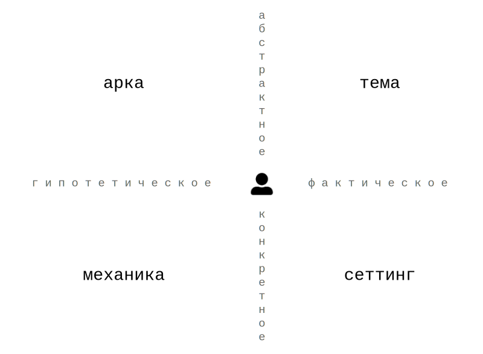
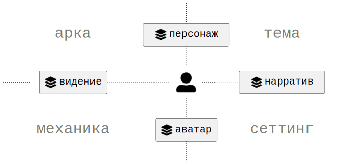
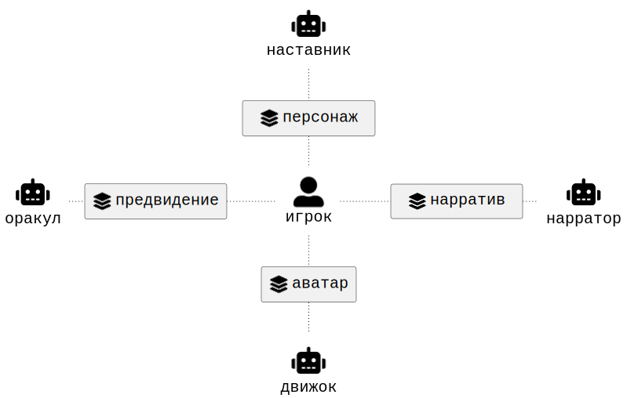

# Что такое игра

Ключевым элементом любой игры является _игрок_. Игроков может быть несколько. Все, что противостоит отдельновзятому игроку является _средой_. Это могут быть другие игроки или боты.

    

## Оси и аспекты

Для описания игры используется система координат из двух независимых осей.

Первая ось различает _возможность_ и _данность_. Возможность описывает то, что может быть реализовано в процессе игры. Данность описывает то, что уже присутствует в игре.

Вторая ось различает _воплощение_ и _идею_. Идея описывает смысловые и концептуальные структуры игры. Воплощение описывает их непосредственную реализацию.

    

Пересечение этих осей образует четыре _аспекта_ игры.

_Арка_ [^1] описывает направления возможных изменений и преобразований. Она относится к возможности на уровне идей.

_Механика_ [^1] описывает способы реализации этих изменений. Она относится к возможности на уровне воплощения.

_Тема_ [^2] описывает смысловое содержание игры. Она относится к данности на уровне идей.

_Сеттинг_ [^2] описывает контекст игры: мир, объекты, обстоятельства и сущности. Он относится к данности на уровне воплощения.

    

 

## Протоколы и компоненты

Как игрок взаимодействует с аспеками игры? Можно ли "потрогать" механику или сеттинг? Кажется, что нет. Нужен некий посредник взаимодействия, который по определению находится где-то на границе. Такого посредника мы будем называть _протоколом_. На стыке арки и темы проектируется _персонаж_, на стыке механики и сеттинга — _аватар_, на стыке арки и механики — _видение_, на стыке темы и сеттинга — _нарратив_.

Персонаж — это протокол _намерений_ игрока, обусловленный аркой и темой. Через персонажа игрок получает доступ к смыслам игры и к пространству своего возможного изменения. Персонаж отвечает на вопрос: кто я в этой истории и кем могу стать.  
Аватар — это протокол _действий_ игрока, обусловленный механикой и сеттингом. Через аватара игрок получает доступ к тому, что он может сделать, и к миру, в котором это происходит. Аватар отвечает на вопрос: что я могу сделать прямо сейчас и где я нахожусь.  
Видение — это протокол _допущений_ игрока, обусловленный аркой и механикой. Через видение игрок получает представление о потенциальном развитии той или иной ситуации. Видение отвечает на вопрос: к чему приведут те или иные воздействия и приближают ли они к цели.  
Нарратив — это протокол _суждений_ игрока, обусловленный темой и сеттингом. Через нарратив игрок получает представление о значении конкретных событий мира. Нарратив отвечает на вопрос: что означает то, что произошло, и как это связано с тем, про что эта игра.

    

Среда — это набор _компонентов_, реализующих протоколы. Персонаж реализуется _наставником_, нарратив — _нарратором_, аватар — _движком_ и видение — _оракулом_.

    

## Примеры

#### Шахматы

Домены:
- **Тема** — война/сражение с трёхактной структурой (дебют/миттельшпиль/эндшпиль). Нигде явно не зафиксирована, подразумевается.  
- **Сеттинг** — средневековье. Выражено визуальным языком фигур.  
- **Механика** — правила хода каждой фигуры. Полностью открыта обоим акторам.  
- **Арка** — стиль игры, который может меняться по ходу партии

Протоколы + компоненты:
- Персонаж / Наставник — стиль игры. Исполняется игроком. В серьёзной игре — исполняется тренером как средой.
- Аватар / Движок — список фигур, которые могут ходить прямо сейчас. Хранит текущее состояние доски. Исполняется игроком.
- Видение / Оракул — дерево детерминированных вариантов. Глубина дерева и есть мастерство. Исполняется игроком.
- Нарратив / Нарратор — история суждений по поводу хода партии. Исполняется игроком. В серьёзной игре — исполняется тренером и/или комментатором как средой.

Итого:
- Два абсолютно симметричных актора с одинаковыми правами доступа.
- Все компоненты среды исполняются игроками.
- Движок является единственным компонентом, который представлен физически. Остальные компоненты представленны ментально в виде навыков, которые вырабатываются на тренировках.

[^1]: Термины арки и механики взяты из [статьи](https://lostgarden.com/2012/04/30/loops-and-arcs) и [доклада](https://www.youtube.com/watch?v=qwPe3OHR04c) Даниэля Кука. Или на русском из [доклада](https://www.youtube.com/watch?v=RDZdxjzFKzI&t=968s) Андрея Столярова. В оригинале Кук использует термин _loop_, но в качестве примеров приводит различные механики. Столяров подтверждает, что "петли это просто понятие, которое используется для описания игровых механик".  
[^2]: Подразумевается тема и сеттинг в литературном смысле, т.к. в сообществе настольщиков часто сеттинг называют темой. Но существуют и обратные примеры (например, [раз](https://louardongames.blogspot.com/2014/08/theme-setting.html), [два](https://bumblingthroughdungeons.com/theme-setting-and-mechanics-in-games) и [три](https://www.youtube.com/watch?v=tAHnu4PIyG0)).  
