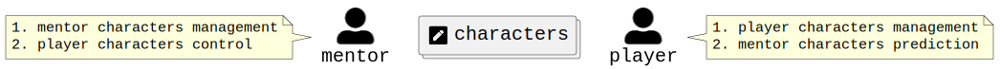

# Поверхностная модель

## Акторы

Начнем с _игрока_, который по праву занимает центральное место в нашей модели. Игрок является актором, уровень субъектности которого может варьироваться от жанра к жанру. Чем больше правил актор может добавлять, изменять, применять или игнорировать, тем больше у него субъектности. Возьмем, к примеру, настольно-ролевые игры (НРИ), обычные настольные игры (НИ) и компьютерные визуальные новеллы (ВН). Больше всего субъектности будет у игрока НРИ, меньше всего — у игрока ВН, а субъектность игрока НИ будет где-то посередине.

    

Но игрок — не единственный актор в игре. В ней может присутствовать еще один: _среда_. Среда может исполнять две роли: _наставника_ (оперирует протоколом персонажа) и _движка_ (оперирует протоколом аватара). Например, наставником в НРИ является реальный человек, а движком в [Особняках безумия](https://boardgamegeek.com/boardgame/205059) — специальное приложение. В обычных НИ среда как отдельный актор отсутствует — её роли распределены между игроками через правила игры, но бывают и исключения[^1]. В качестве упражнения можно взять настолки и выстроить в один ряд. Тогда на одном конце окажутся нарративные квесты (например, [Зачарованная](https://boardgamegeek.com/boardgame/364544)), у которых под капотом сложный алгоритм работы наставника, а движок и вовсе может отсутствовать. На другом — абстракты (например, [Азул](https://boardgamegeek.com/boardgame/230802)), у которых под капотом сложный алгоритм работы движка, а наставник и вовсе может отсутствовать.  

    

Чем же акторы занимаются в игре? Тут особо без вариантов. Они _взаимодействуют_, пытаясь оказать влияние друг на друга. Но есть один нюанс — прямое взаимодействие крайне нежелательно, т.к. негативно сказывается на игровом опыте. Поэтому для полноценного погружения требуется посредник, а точнее два.  

    

## Протоколы

Посредником между наставником и игроком выступает _персонаж_. Старый-добрый литературный персонаж. Если провести аналогию, то персонаж для игрока - это такой большой трафарет, который может меняться по ходу игры. Как трафарет позволяет воспроизвести лишь ограниченный набор изображений, так и персонаж - лишь ограниченный набор _намерений_. Как происходит взаимодействие? Чтобы составить какое-либо намерение, игрок подаёт запрос через персонажа, затем наставник принимает решение по поводу исхода (чаще всего с оглядкой на логику). В свою очередь, наставник может наслать на персонажа какую-либо "идейную" напасть/благодать, после чего игрок принимает решение по поводу сложившейся ситуации. Таким образом игрок управляет собственными персонажами и предсказывает персонажей наставника. наставник управляет собственными персонажами и контролирует персонажей игрока.  

    

Посредником между игроком и движком выступает _аватар_. Всеми любимый пандорский аватар. Если провести аналогию, то аватар для игрока - это такая большая приборная панель, которая может меняться по ходу игры. Как панель может стать проводником лишь ограниченного набора управляющих воздействий, так и аватар - лишь ограниченного набора игровых _действий_. Как происходит взаимодействие? Чтобы выполнить какое-либо действие, игрок подаёт команду через аватара, затем движок принимает решение по поводу исхода (чаще всего с оглядкой на физику). В свою очередь, движок может наслать на аватара какую-либо "физическую" напасть/благодать, после чего игрок принимает решение по поводу сложившейся ситуации. Таким образом игрок управляет собственными аватарами и предсказывает аватаров движка. Движок управляет собственными аватарами и контролирует аватаров игрока.  

    

Осталось разобрать то, что дарит самые яркие эмоции - взаимодействие между игроками. Если с наставником и движком игрок взаимодействует строго через одного персонажа и аватара соответственно, то с другим игроком приходится взаимодействовать минимум через двух персонажей и/или аватаров. Как следствие, возникают целые системы [персонажей](https://blog.selfpub.ru/sistema-personazhey) и аватаров, к которым в обязательном порядке прилагаются _издержки взаимодействия_, но об этом как-нибудь в другой раз. Опытные игроки способны удерживать в голове очень сложные конфигурации, виртуозно подстраиваясь под ограничения, накладываемые особенностями своих персонажей и аватаров.  

    

## Резюме

Кратко резюмируем получившуюся модель. Ключевой актор любой игры — игрок. Игроков может быть несколько. На «идейном» уровне игроки взаимодействуют через своих персонажей. На «физическом» — через аватаров. В некоторых играх добавляется еще один актор: среда, исполняющая роли наставника и/или движка, которые с одной стороны устанавливают рамки для персонажей и аватаров игрока соответственно, а с другой — управляют собственными персонажами и аватарами соответственно.

[^1]: Например, в игре [Штуки в круге](https://boardgamegeek.com/boardgame/408547) в русской локализации фасилитирующего игрока [назвали](https://www.youtube.com/watch?v=VUJpANfWEw0) наставником.
